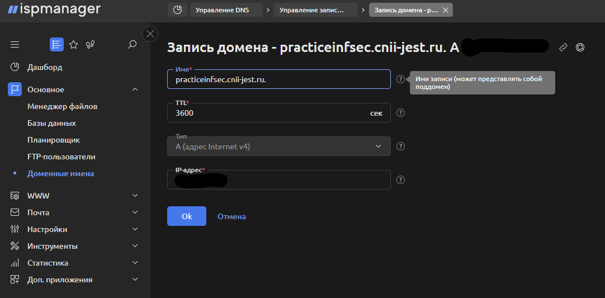
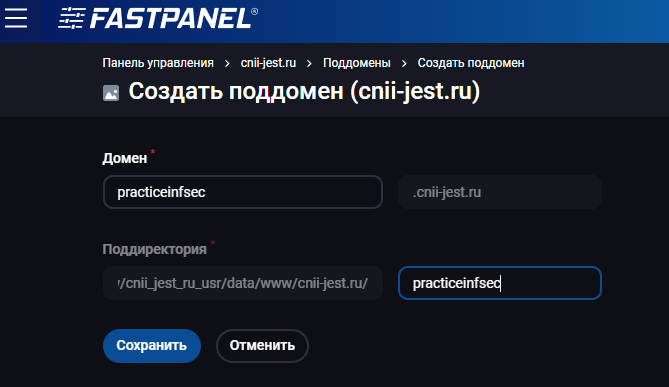
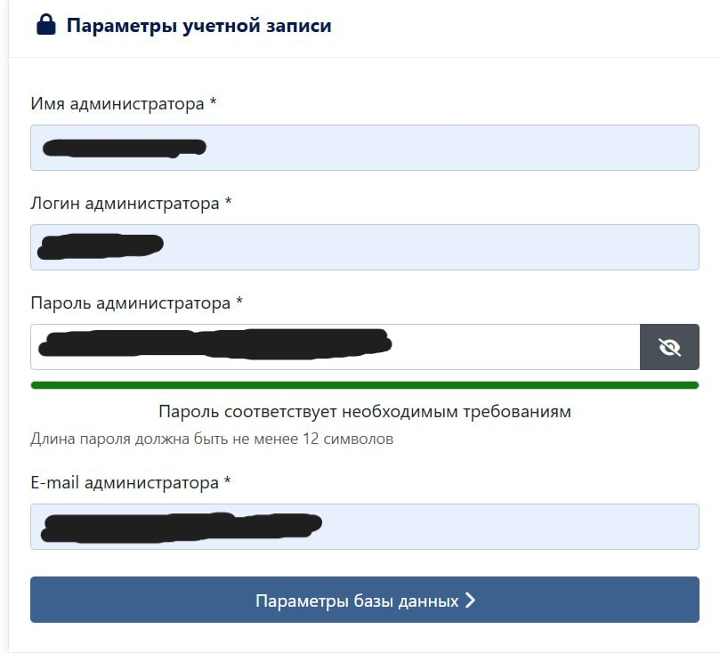
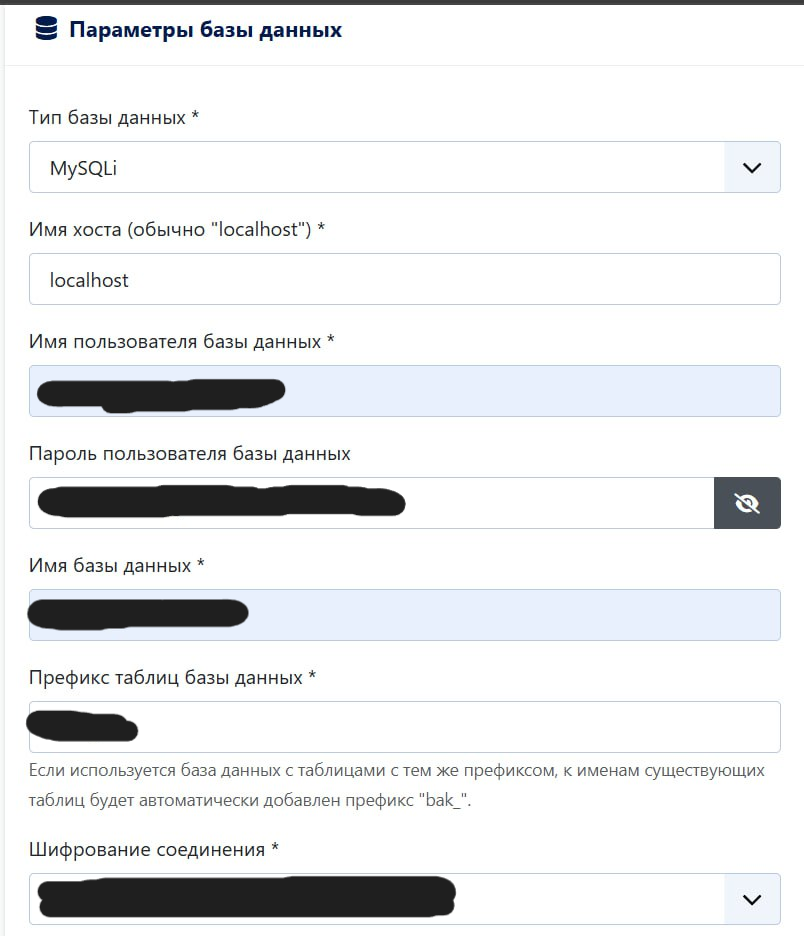
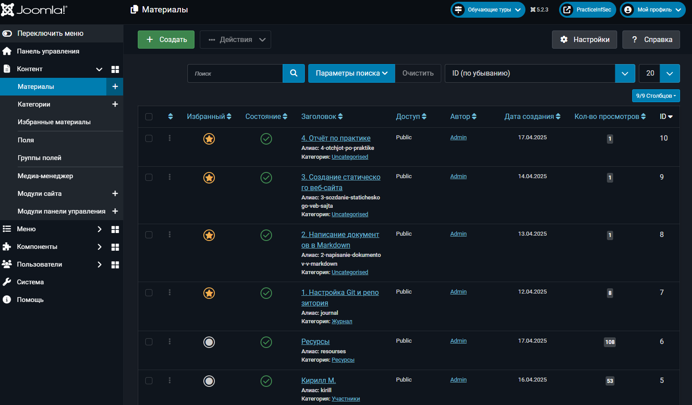
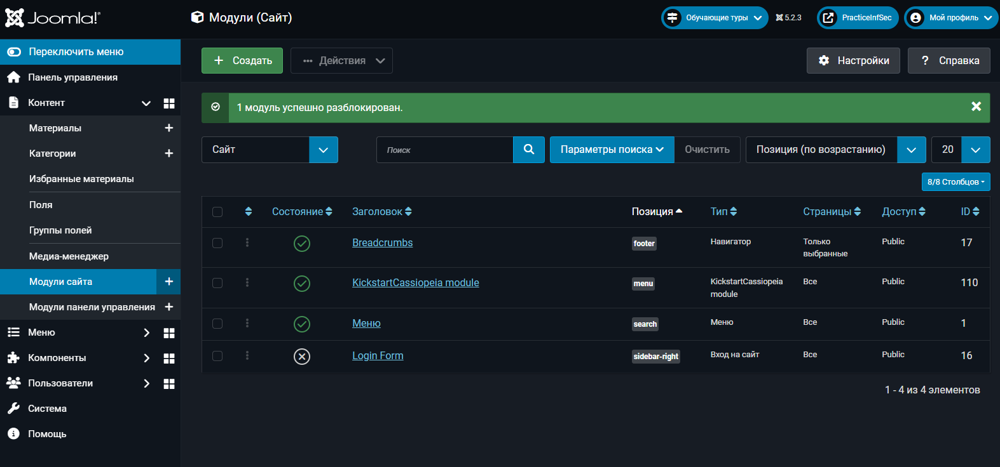

# Создание веб-сайта
**Срок окончания работы над задачей:** 27 апреля 2025 года.

## Выбор технологий для создания веб-сайта
Для упрощения создания веб-сайта было принято решение использовать в работе [Joomla CMS](https://www.joomla.org). Для публикации сайта была использована 
панель управления веб-хостингом [Fastpanel](https://fastpanel.direct/). Эти инструменты были выбраны, так как они используются в Лаборатории ЦНИИ Русского Жестового Языка(Проект «Разработка платформы жестовой коммуникации») и освоены выполняющими практику.

## Созданеи поддомена для сайта
На сайте регистратора доменных имён был создан поддомен основного сайта — cnii-jest.ru, а именно practiceinfsec, путём прописывания А-записи, и после обновления DNS-записей
поддомен стал доступен.

## Создание сайта в панели управления веб-хостингом
В веб интерфейсе панели управления был создан [сайт](practiceinfsec.cnii-jest.ru/) как поддомен основного сайта, затем была создана база данных для обеспечения функционирования CMS и была произведена настройка сайта. На данном этапе по домену была доступна стандартная заглушка, которую Fastpanel генерирует для вновь созданных сайтов.

## Развёртывание Joomla CMS и настройка сайта
С официального сайта был скачан архив с самой CMS и разархвирован в папку поддомена в корне сайта. После этого по домену стал доступен стандартный диалог Joomla для конфигурирования сайта. Там были указаны логин, пароль и электронная почта администратора и сконфигурировано подключение к ранее созданной базе данных MySQL. После окончания развёртывания сайта по домену стал доступен стандартный сайт Joomla и панель администрирования.

## Заполнение сайта информацией по проекту
После входа в панель управления были созданы разделы сайта, к каждому разделу были прикреплены материалы, а именно текстовая информация, изображения и ссылки. Был создан логотип сайта, установлен модуль KickstartCassiopeia и в нём было настроено визуальное оформление сайта

